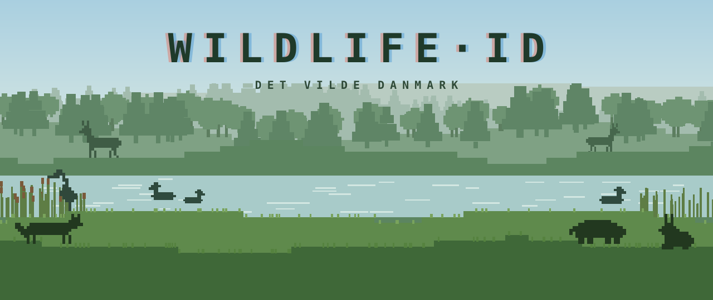

<p align="center">
  
</p>

<p align="center">
  <a href="https://bjornfs.github.io/WildlifeID/"></a>
  <a href="https://github.com/BjornFS/WildlifeID/actions/workflows/deploy.yml"></a>
  
  
  
</p>

<p align="center">
  <b>Learn to tell Danish wildlife apart, one photo at a time.</b><br>
  A small quiz game for the mammals and birds of Denmark (in Danish), dressed as a retro pixel walk in the woods.
</p>

---

## Modes

| Mode | |
|---|---|
| **Daglig udfordring** | Ten species a day, the same for everyone. A calendar tracks the days you've cleared, and perfect days are marked in green. |
| **Endless** | Keep naming animals until you miss one. Your best run is saved as a highscore. |
| **Feltguide** | A field guide to all 107 species: photo, Latin name, distinguishing features, habitat and lookalikes. Any category can be practised as a short 8-question round. |

The trickiest pairs, such as *husmår / skovmår*, *bisamrotte / sumpbæver* and *duehøg / spurvehøg*, are always asked side by side, so you can't guess from the category alone. After each answer you get the species' key features (*kendetegn*), its lookalikes and quick facts.

Works on phones and desktop. On desktop, keys `1`–`4` pick an answer and `Enter` moves on.

## Run it locally

```bash
npm install
npm run dev
```

Then open http://localhost:5173. There's no backend: daily results and the highscore are kept in the browser's local storage.

## How it works

Everything the quiz knows lives in plain data files in [`src/data/`](src/data/):

- **Groups** (`groups.js`): *Pattedyr* (mammals) and *Fugle* (birds).
- **Categories** (`categories.js`, `birdCategories.js`): families such as *Hjortevildt* or *Rovfugle*. Answer options are always drawn from the photo's own category, so a deer photo only offers other deer.
- **Species** (`species.js`, `birdSpecies.js`): one entry per animal with its names, photos, category, habitat, activity, rarity, key feature and the species it's most often confused with. The field list is documented at the top of `species.js`.

A new species only needs an entry in one of the species files; it shows up in every mode automatically.

## Adding photos

Original photos live in [`photos/`](photos/), one folder per group and category. They aren't served directly. Instead, a script makes web-sized WebP copies (1600 px, plus 360 px thumbnails) in `public/images/`:

```bash
npm run photos
```

Then list the `.webp` path on the species in `src/data/species.js` or `src/data/birdSpecies.js`:

```js
images: ["/images/pattedyr/hundedyr/raev_1.webp"],
```

See [`photos/README.md`](photos/README.md) for details.

## Project layout

```
src/
  main.jsx              entry point
  App.jsx               which screen shows, the current run, and the quiz screen

  data/                 what the quiz knows (edit these to add animals)
    species.js            mammals
    birdSpecies.js        birds
    categories.js         mammal categories (Hjortevildt, Mårvildt, …)
    birdCategories.js     bird categories (Rovfugle, Gæs, …)
    groups.js             mammals + birds combined
    biomes.js             the fixed list of habitats

  game/                 rules, no UI
    rounds.js             which animal and photo comes next
    options.js            answer options and lookalike pairs
    dailyChallenge.js     date-seeded daily picks and saved results
    endless.js            endless highscore
    stats.js              per-category results and the daily share text

  screens/              one file per full screen
    Menu.jsx              home screen
    DailyCalendar.jsx     daily challenge calendar
    FieldGuide.jsx        the field guide (Feltguide)

  components/           pieces used by the screens
    Shell.jsx             retro frame: landscape, top bar, bottom nav
    ResultPopup.jsx       end-of-run pop-up
    DailySummary.jsx      the daily challenge's stats and share row
    AnimalImage.jsx, StatsBox.jsx, Lookalikes.jsx,
    EndlessProgress.jsx, RunDots.jsx, PixelSparkles.jsx,
    PixelNumber.jsx, DailyBanner.jsx, facts.jsx

  lib/                  small helpers
    asset.js, sound.js, analytics.js, useMediaQuery.js,
    natureScene.js        the pixel landscape (generated SVG)

  styles/
    App.css               base styles
    Retro.css             the retro look, desktop and phone layouts

scripts/
  optimize-photos.mjs   photos/ → public/images/ (WebP)
  make-banner.mjs       builds docs/banner.svg for this README
```

## Deployment

Every push to `main` builds the site and publishes it to GitHub Pages ([workflow](.github/workflows/deploy.yml)). You can also start a deploy by hand from the Actions tab with **Run workflow**.

---

<p align="center"><sub>Photos: <a href="https://www.pexels.com">Pexels</a> · Made in Denmark 🌲</sub></p>
